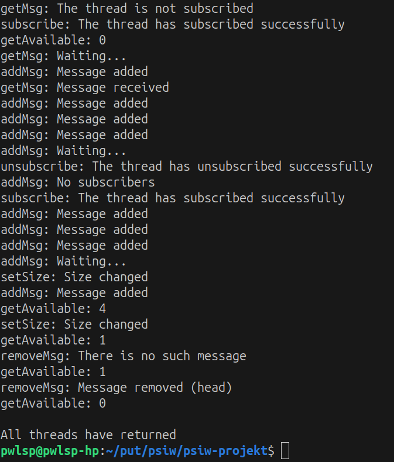

Paweł Spychała 160157

Projekt jest dostępny w repozytorium pod adresem:  
<https://github.com/pwlsp/psiw-projekt>

# Struktury danych

Projekt zawiera dwie struktury danych: `TQElement` oraz `TQueue`.

## TQElement
`TQElement` to struktura przechowująca pojedynczą wiadomość w kolejce `TQueue`.

```c
typedef struct TQElement
{
    void *msg;
    int addr_count;
    int addr_size;
    pthread_t *addressees;
    struct TQElement *next;
} TQElement;
```

Opis zmiennych:

- `msg` - wskaźnik typu `void` na teoretyczną wiadomość.
- `addr_count` (od *addressee count*) - liczba całkowita przechowująca .liczbę adresatów danej wiadomości, zapisanych w tablicy `addressees`.
- `addr_size` - liczba całkowita przechowująca aktualny (maksymalny) rozmiar dynamicznej tablicy `addressees`.
- `next` - wskaźnik na następny element kolejki `TQueue`. Następny element jest typu `TQElement`.

## TQueue

`TQueue` to struktura będąca kolejką przechowującą wiadomości w postaci zmiennych typu `void *`. Zmienne te są opakowane w strukturę `TQElement` opisaną powyżej. Wiadomości docelowo mogą być odebrane przez wątki, które "zasubskrybują" kolejkę `TQueue`. Jak w klasycznej kolejce - każdy jej element zawiera wskaźnik na następny, dzięki czemu zachowana jest spójność struktury. Sama struktura `TQueue` zawiera zmienne niezbędne do funkcjonowania kolejki i wykonywania na niej określonych operacji.

```c
typedef struct TQueue
{
    pthread_mutex_t mx_queue;
    pthread_cond_t cond_new_message, cond_free_space;
    int size;
    int msgs_count;
    int subs_count;
    int subs_size;
    TQElement *head;
    TQElement *tail;
    pthread_t *subscribers;
} TQueue;
```

Opis zmiennych:

- `mx_queue` - mutex blokujący dostęp do ingerencji w strukturę `TQueue`.
- `cond_new_message`, `cond_free_space` - zmienne warunkowe, odpowiadające za czekanie lub wysyłanie sygnału odpowiednio o: pojawieniu się nowej wiadomości w `TQueue`, oraz pojawieniu się wolnego miejsca na wiadomość w `TQueue`.
- `size` - maksymalna ilość wiadomości jaką może pomieścić kolejka.
- `msgs_count` - liczba wiadomości znajdujących się w kolejce.
- `subs_count` - liczba subskrybentów kolejki, przechowywanych w tablicy `subscribers`.
- `subs_size` - aktualna wielkość dynamicznej tablicy `subscribers`.
- `head` - wskaźnik na `TQElement`, będący na początku kolejki.
- `tail` - wskaźnik na ostatni `TQElement` kolejki.
- `subscribers` - tablica przechowująca listę subskrybentów kolejki.

# Funkcje

Zadanie zostało wykonane wyłącznie przy użyciu funkcji zawartych w zadanym pliku nagłówkowym.

# Charakterystyka implementacji

## Uzasadnienie odporności algorytmu typowe problemy przetwarzania współbieżnego

**Aktywne oczekiwanie:**

Wątek-subskrybent może chcieć rozpocząć oczekiwanie w dwóch sytuacjach:

1. Gdy chce dodać wiadomość do kolejki, lecz jest ona pełna.
2. Gdu chce odebrać wiadomość z kolejki, lecz nie ma tam żadnej wiadomości przeznaczonej dla tego wątku

W prezentowanym algorytmie obie w obu sytuacjach oczekiwanie nie będzie aktywne, gdyż zastosowano mutex i zmienne warunkowe przeciwdziałające aktywnemu sprawdzaniu wystąpienia tych przypadków (`pthread_cond_wait` i `pthread_cond_signal`).

**Zakleszczenie:**

Zaimplementowane funkcje nie pozwalają na wystąpienie zakleszczenia dwóch (lub więcej) wątków. Zamki i zmienne warunkowe pozwalają na efektywne wybudzanie oczekujących wątków i nie dostrzegłem możliwości wystąpienia zakleszczenia.

**Głodzenie:**

Głodzenie również nie powinno wystąpić, gdyż wątki oczekujące na nową wiadomość w dalszym ciągu są subskrybentami kolejki, przez co dowolna dodana wiadomość wybudzi je. Wątki czekające na miejsce w kolejce również skorzystają z dowolnej okazji na zakończenie swojej operacji. Nie występuje priorytetyzowanie żadnego z wątków.

## Sytuacje skrajne

We wszystkich rozpatrzonych sytuacjach skrajnych algorytm przebiega pomyślnie:

- W przypadku gdy żaden wątek nie subskrybuje kolejki:
	- Dodanie wiadomości nie następuje, gdyż nie miałaby odbiorców
	- Funkcja odsubskrybowania nic nie zmienia
- Ustawienie wielkości kolejki na 0 działa poprawnie.
- Dodawanie wiadomości do pełnej kolejki powoduje czekanie. Próba odbioru wiadomości, której nie ma powoduje czekanie.
- Próba odbioru wiadomości przez wątek, który nie subskrybuje przebiega bez błędu.
- Ponowna subskrypcja / anulowanie subskrypcji nie powoduje dodatkowych zmian.

# Przykład użycia

Poniżej znajduje się wynik działania programu dla wątków utworzonych w pliku `main.c` (dla odkomentowanych operacji pisania na ekran).
Skompilowano komendą:
``` bash
gcc -pthread -Wall main.c queue.c
```

